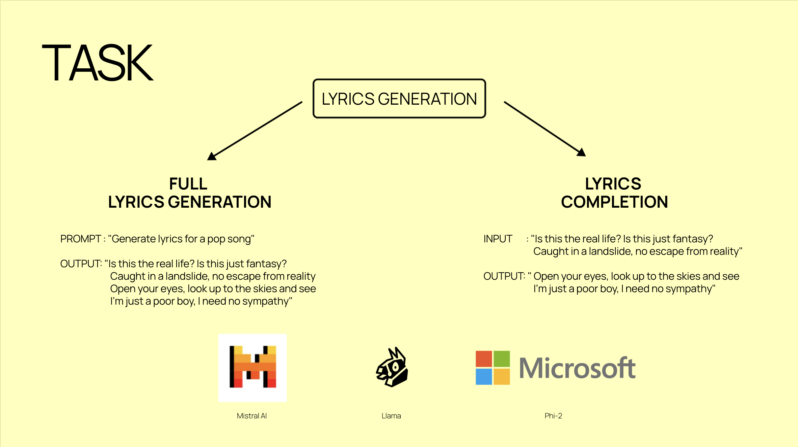

# LLM_LyricsGeneration

Repository for the final project of the 2023 Data Mining course, taught by Aris Anagnostopoulos at Sapienza, Rome. 🇮🇹

## Datasets 🎤

The dataset for **full lyrics generation** task is composed of 10000 song lyrics divided into 5 genres: indie, metal, pop, rap and rock. Each genre has 20 artist with 100 songs each. All songs are in English 🇬🇧
Check it in this repo or on [Kaggle](https://www.kaggle.com/datasets/simoneteglia/lyrics-dataset-rock-pop-rap-metal-indie)

The dataset for the **lyrics completion** task, containing 243 Kanye West songs is public on Kaggle [here](https://www.kaggle.com/datasets/viccalexander/kanyewestverses?rvi=1)

## Tasks

## Trained models on HuggingFace

1. [Phi-2 for 'full lyrics generation'](https://huggingface.co/simoneteglia/phi-2-lyrical-genius)
2. [Mistral7B for 'lyrics completion'](https://huggingface.co/simoneteglia/ye_mistral7B)
